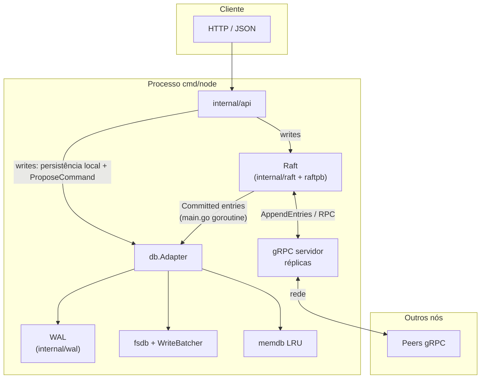
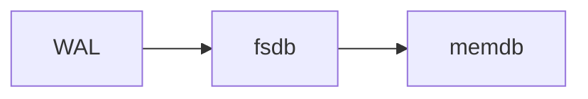

# kvs

Armazenamento chave–valor distribuído em Go: réplicas coordenadas por **Raft** (gRPC entre nós) e API **HTTP/JSON** para clientes. Persistência combina **WAL** (durabilidade e recuperação), **fsdb** em disco (com escrita em batch opcional) e **memdb** em memória com LRU configurável.

## Requisitos

- Go **1.26.1** (ver `go.mod`)
- Para gerar protos: `protoc` e plugins (`make proto`)
- Opcional: `jq` para os alvos `make state1` etc.

## Uso rápido

```bash
make build
make run-single-node    # HTTP :8001, gRPC :9001
```

Cluster de três nós: um terminal por `make run1`, `make run2`, `make run3` (portas 8001–8003 / 9001–9003).

Variáveis de ambiente (trecho): `MEMDB_MAX_ENTRIES`, `CHECKPOINT_INTERVAL`, `FS_DEFER_WRITES`, `FS_FLUSH_INTERVAL` — ver `internal/cfg/cfg.go` e `Makefile`.

## Arquitetura do nó

Diagrama de componentes e fluxos principais:



No **leader**, escritas mutantes na API chamam o `Adapter` antes de `ProposeCommand`. Nos **followers**, o mesmo `Adapter` é atualizado só depois do commit, pelo fluxo acima.

Camadas de dados no **Adapter** (escrita na ordem: log → disco → memória):



## Rotas HTTP principais

| Método | Caminho | Função |
|--------|---------|--------|
| `POST` | `/table` | Criar tabela |
| `PUT` | `/table/{tableName}/{key}` | Escrever item |
| `GET` | `/table/{tableName}/{key}` | Ler por chave |
| `GET` | `/table/{tableName}?sk=…` | Busca por chave secundária |
| `DELETE` | `/table/{tableName}/{key}` | Remover |
| `GET` | `/state` | Estado Raft / cluster |

Proposta manual de comando: `make propose ADDR=localhost:8001 CMD='…'` (ver `Makefile`).

## Estrutura do repositório

- `cmd/node` — binário do nó
- `internal/` — Raft, store/WAL, db, API HTTP, cfg, tasks periódicas
- `pkg/www` — utilitários HTTP compartilhados
- `proto/raft` — definições gRPC
