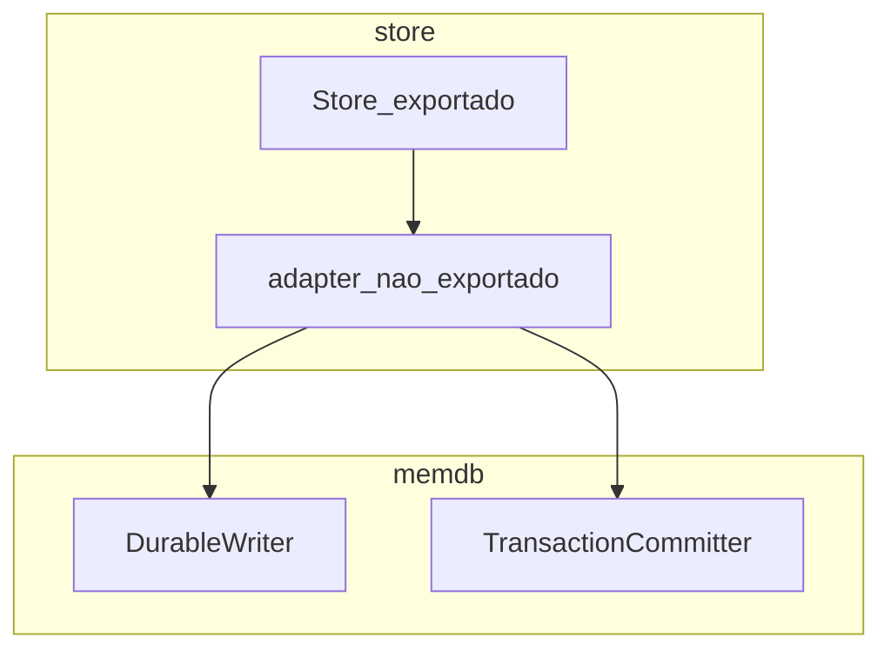

# Especificação: mutações do `store` só para uso interno (`Put`, `Delete`, `CommitTransaction`)

## Objetivo

Reduzir a superfície pública do pacote `store` para que **`Put`**, **`Delete`** e **`CommitTransaction`** deixem de ser métodos expostos em `*Store`, alinhado à convenção de que **aplicações mutam só via `Table`** (`Set`, `Delete`, `NewSession`, etc.), enquanto o `store` continua a ser o único responsável por WAL, sequência e aplicação em memória.

## Situação actual

- `*Store` implementa `memdb.DurableWriter` (`Put`, `Delete`) e `memdb.TransactionCommitter` (`CommitTransaction`).
- O `memdb` chama esses métodos quando a durabilidade está injectada (`SetDurable`) e quando uma sessão transaccional faz commit.
- Os mesmos nomes ficam disponíveis em `*Store` para qualquer importador de `store`, mesmo quando a intenção é não usá-los na camada da aplicação.

## Restrição em Go

Para satisfazer uma interface definida noutro pacote (`memdb`), o tipo implementador precisa de métodos com **assinaturas e nomes** que batem certo com a interface — por exemplo `Put(table string, item Item) error`. Isso **não obriga** que esses métodos vivam em `*Store`: podem pertencer a **outro tipo** no pacote `store`, desde que esse tipo implemente a interface e seja o valor passado a `database.SetDurable(...)`.

Ou seja: o problema não é “tornar `Put` privado em Go” no tipo que implementa a interface (os métodos da interface continuam exportados **no tipo que a implementa**), mas sim **não os expor em `*Store`**, movendo a implementação da interface para um tipo auxiliar não exportado.

## Abordagem recomendada (adapter interno)

Introduzir um tipo **não exportado** no pacote `store`, por exemplo `storeDurable` ou `durableAdapter`, que:

- guarda um ponteiro para `*Store` (ou os campos estritamente necessários: WAL, `mu`, `db`, contadores de sequência, opções);
- implementa `memdb.DurableWriter` e `memdb.TransactionCommitter` com `Put`, `Delete`, `CommitTransaction`;
- delega para métodos **não exportados** de `*Store` (ex.: `putLocked`, `deleteLocked`, e a lógica actual de `CommitTransaction` refactorizada para `commitTransactionLocked` ou equivalente).

Fluxo em `Open`:

1. Construir `*Store` como hoje.
2. Criar `d := &storeDurable{s: s}` (nome fictício).
3. Chamar `database.SetDurable(d)` em vez de `database.SetDurable(s)`.
4. Para `TransactionCommitter`, o `memdb` pode usar o mesmo valor se o tipo implementar ambas as interfaces, ou dois adapters que partilham estado — o desenho mínimo é um único tipo que implementa as duas interfaces.

Assim, **código fora de `internal/store`** só vê `*Store` com API de ciclo de vida e diagnóstico (`Open`, `Close`, `Checkpoint`, `Flush`, `AppDB`, `DB`, campos exportados que se mantiverem), **sem** `Put`/`Delete`/`CommitTransaction` nesse tipo.

## Variantes e tradeoffs

| Opção | Prós | Contras |
|-------|------|--------|
| **Adapter não exportado (recomendado)** | Remove `Put`/`Delete`/`CommitTransaction` da API de `*Store`; mantém interfaces do `memdb` inalteradas | Um tipo extra; `Open` deve construir e ligar o adapter correctamente |
| **Manter métodos em `Store` mas documentar como “não usar”** | Zero refactor | Não cumpre o objectivo de encorajar só `Table`; API continua tentadora |
| **Mover interfaces para `internal/...` com métodos não exportados** | Nomes internos mais flexíveis | **Não resolve** por si: interfaces noutro pacote continuam a exigir métodos exportados no implementador; só faria sentido com interfaces no mesmo pacote que o `Store`, o que empurra acoplamento ou um pacote `internal/durability` partilhado |
| **Gerar `go:generate` / wrappers** | Automação | Complexidade desnecessária para este tamanho de código |

## Impacto em testes

- Testes no ficheiro `store_test.go` com `package store` podem continuar a chamar funções **não exportadas** ou factoring interno (`putLocked`, etc.) se for aceitável para testes unitários.
- Se os testes usarem `package store_test` (cliente externo), devem passar a exercitar persistência via **`Table`** / `Store.Open` + `AppDB`, ou expor um **helpers de teste** apenas em ficheiros `_test.go` (por exemplo `export_test.go` com símbolos de teste — usar com parcimónia).

## Plano de acção sugerido

1. Extrair a lógica actual de `Put`, `Delete` e `CommitTransaction` para métodos não exportados de `*Store` (já existe `putLocked` / `deleteLocked`; falta equivalente para transacção).
2. Introduzir o tipo adapter não exportado que implementa `memdb.DurableWriter` e `memdb.TransactionCommitter` delegando para esses métodos.
3. Em `Open`, substituir `database.SetDurable(s)` por `database.SetDurable(adapter)`.
4. Remover `Put`, `Delete`, `CommitTransaction` como métodos de `*Store` (ou deixá-los apenas no adapter).
5. Actualizar testes que chamam `s.Put` / `s.Delete` directamente para usar `table.Set` / `table.Delete` ou chamadas internas nos ficheiros `package store`.
6. Verificar `var _ memdb.DurableWriter = (*Store)(nil)` e o equivalente para `TransactionCommitter`: passar a apontar para **`*adapter`**, não para `*Store`.
7. Correr `go test ./...` e revisar exemplos/documentação que mencionem `store.Put` na camada da aplicação.

## Relação com outros documentos

- [separacao-camadas-store-memdb-db.md](./separacao-camadas-store-memdb-db.md): a fachada `db` e o uso de `Table` como entrada da app continuam válidos; esta spec fecha a lacuna da API “dupla” no `store`.
- O formato WAL e o significado das operações não precisam de mudar — apenas **quem** expõe os métodos que o `memdb` invoca por interface.

## Critério de aceite

- Nenhum símbolo exportado em `*Store` nomeado `Put`, `Delete` ou `CommitTransaction`.
- `memdb` continua a conseguir persistir mutações e commits transaccionais após `Open`.
- Testes verdes e exemplos (`main`) sem depender de `s.Put` / `s.Delete` na camada da aplicação.
