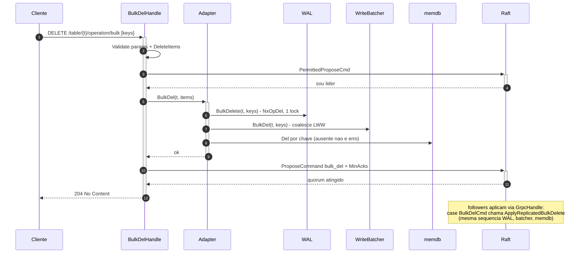

# Bulk delete: exclusão em lote por tabela

Espelho do bulk put já implementado (`api.BulkPutHandle` → `BulkPutCmd` → `Adapter.BulkSet`/`ApplyReplicatedBulk` → `WAL.BulkSet` → `fsdb.BulkSet`).

## Contrato HTTP

```
DELETE /table/{tableName}/operation/bulk?raft_min_acks=N
Body: [{"key": "user:1"}, {"key": "user:2"}]
```

- Sucesso: `204 No Content` (como o DELETE unitário; bulk put devolve `200` por simetria com o PUT unitário).
- `400` body/params inválidos ou lote vazio; `422` item sem `key` (envelope `FieldError`, como no bulk put).
- Follower rejeita via `PermittedProposeCmd` apontando o líder (SDK já trata).
- **Idempotente:** chave inexistente é ignorada, lote continua, resposta `204` (diverge do `Del` unitário de propósito — retry de lote não pode falhar por chave já ausente). O `WriteBatcher.applyOneLocked` já implementa isto no flush: `db.ErrNotFound` em `batchOpDel` conta como sucesso.

## Decisões de desenho

1. **Reutilizar `commands.Data.Items`** com só `Key` preenchido, em vez de campo novo no log Raft — mesmo padrão do `DeleteCmd`, que reutiliza `Data.Item` e converte com `DelItem()` no apply.
2. **Invalidação da cache é obrigatória** — diferença vs. bulk put, que não toca na memdb (lacuna conhecida: valor obsoleto até TTL). Para delete, servir item excluído da cache é bug funcional, não staleness tolerável.
3. **Ordem log → disco → memória** mantida (WAL → fsdb → memdb), como todo o `Adapter`.
4. **Não atómico** — falha parcial deixa chaves já excluídas (mesmo contrato do `fsdb.BulkSet`).

## Implementação por ficheiro

### 1. `internal/dto/delete_item.go` (estender)

```go
type DeleteItems []DeleteItem

// Validate: lote vazio é erro; cada item exige key não vazia.
// Version é ignorado neste fluxo (sem optimistic lock em lote).
func (ds DeleteItems) Validate() *FieldError {
	output := NewFieldError()
	if len(ds) == 0 {
		output.AddErr(errors.New("bulk delete requires at least one item"))
		return output.Build()
	}
	for _, d := range ds {
		if strings.TrimSpace(d.Key) == "" {
			output.AddErr(errors.New("field key is required"))
		}
	}
	return output.Build()
}

// Items converte para o transporte no log Raft (commands.Data.Items).
func (ds DeleteItems) Items() Items {
	out := make(Items, len(ds))
	for i, d := range ds {
		out[i] = d.Item() // já existe: Item{Key, Version}
	}
	return out
}

// Keys extrai as chaves para WAL/fsdb.
func (ds DeleteItems) Keys() []string {
	out := make([]string, len(ds))
	for i, d := range ds {
		out[i] = d.Key
	}
	return out
}
```

Em `internal/dto/item.go`, o conversor inverso para o apply no follower:

```go
// DelItems converte itens replicados via Raft de volta para o fluxo de delete.
func (is Items) DelItems() DeleteItems {
	out := make(DeleteItems, len(is))
	for i, it := range is {
		out[i] = it.DelItem() // já existe
	}
	return out
}
```

Nota: a validação atual de `DeleteItem.Validate` usa `strings.Trim(d.Key, "")`, que é no-op; em `DeleteItems.Validate` usar `strings.TrimSpace`.

### 2. `internal/commands/cmds.go` (1 linha)

```go
BulkDelCmd Commands = "bulk_del"
```

`commands.Data` **não muda**. O comentário do campo `Items` passa a citar ambos: `// optional; used by BulkPutCmd and BulkDelCmd`.

### 3. `internal/api/bulk_del_handle_http.go` (novo)

Cópia estrutural do `bulk_put_handle_http.go`:

```go
type BulkDelDb interface {
	BulkDel(ctx context.Context, tableName string, its dto.DeleteItems) error
}

func BulkDelHandle(db BulkDelDb, replicateNodes ReplicateNodes) www.Handler {
	return www.Handler{
		Pattern: "DELETE /table/{tableName}/operation/bulk",
		Fn: func(r *http.Request) *www.Response {
			// 1. www.DecodeParams em bulkDelParams{TableName `param`, RaftMinAcks `query`}
			//    + Validate() (RaftMinAcks >= 0) → 400 em erro (igual aos outros handlers).
			// 2. minAcks := HTTPDefaultRaftMinAcks(replicateNodes, params.RaftMinAcks)
			// 3. json.Decode do body em dto.DeleteItems → 400 em erro de decode.
			// 4. its.Validate() → 422 com envelope FieldError (mesmo bloco do bulk put:
			//    json.Unmarshal(fe.Json(), &payload) com fallback).
			// 5. replicateNodes.PermittedProposeCmd() → status via getStatusCode(rpcErr.Err()),
			//    payload rpcErr.RespJson() (bloco idêntico ao bulk put).
			// 6. db.BulkDel(r.Context(), params.TableName, its) → getStatusCode(err) em falha.
			// 7. replicateNodes.ProposeCommand(commands.Data{
			//        Cmd: commands.BulkDelCmd, TableName: params.TableName,
			//        Items: its.Items(), MinAcks: minAcks,
			//    }) → mesmo tratamento de rpcErr.
			// 8. www.NewResponse(www.StatusCode(http.StatusNoContent))
		},
	}
}
```

`bulkDelParams` é um struct próprio (não reutilizar `putParams`: este valida `OperationType`, que não existe aqui):

```go
type bulkDelParams struct {
	TableName   string `param:"tableName"`
	RaftMinAcks int    `query:"raft_min_acks"`
}

func (p *bulkDelParams) Validate() error {
	if p.TableName == "" {
		return errors.New("table name is required")
	}
	if p.RaftMinAcks < 0 {
		return errors.New("invalid raft_min_acks")
	}
	return nil
}
```

### 4. `cmd/node/setup/routes.go` (1 linha)

```go
api.BulkDelHandle(database, raftNode),
```

### 5. `internal/db/adapter.go`

Estender as interfaces consumidas pelo `Adapter`:

```go
type DB interface {
	// ...existentes
	BulkDel(ctx context.Context, tableName string, keys []string) error
}

type LogDb interface {
	// ...existentes
	BulkDelete(ctx context.Context, tableName string, keys []string) error
}

type Cache[T item.Entity] interface {
	// ...existentes (Once, DelIfOk, SaveIfOk)
	Del(key string) // evicta se presente; chave ausente é no-op, nunca devolve erro
}
```

Caminho do líder e do follower (o follower não tem `validateConsistency` a saltar — delete em lote nunca valida versão — então os dois corpos são iguais; manter métodos separados pela simetria com o resto do ficheiro e pelos wraps de erro distintos):

```go
func (f *Adapter) BulkDel(ctx context.Context, tableName string, its dto.DeleteItems) error {
	f.mu.Lock()
	defer f.mu.Unlock()
	return f.bulkDelLocked(ctx, tableName, its, "")
}

// ApplyReplicatedBulkDelete applies a committed Raft bulk-delete entry on a follower.
// See ApplyReplicated for the rationale (no consistency validation on replay).
func (f *Adapter) ApplyReplicatedBulkDelete(ctx context.Context, tableName string, its dto.DeleteItems) error {
	f.mu.Lock()
	defer f.mu.Unlock()
	return f.bulkDelLocked(ctx, tableName, its, " (replicated)")
}

func (f *Adapter) bulkDelLocked(ctx context.Context, tableName string, its dto.DeleteItems, suffix string) error {
	keys := its.Keys()

	if err := f.logdb.BulkDelete(ctx, tableName, keys); err != nil {
		return fmt.Errorf("db: wal bulk delete%s: %w", suffix, err)
	}

	if err := f.store.BulkDel(ctx, tableName, keys); err != nil {
		return fmt.Errorf("db: bulk delete entity%s: %w", suffix, err)
	}

	// Uma chamada ao store para N chaves: invalidar a memdb por chave depois do
	// sucesso do disco. Del evicta se presente; chave ausente é no-op — a
	// invalidação de cache jamais falha a operação.
	for _, k := range keys {
		f.cache.Del(f.key(k))
	}

	return nil
}
```

> **Não** reutilizar `DelIfOk` com `fn` no-op: o acoplamento "remove só se o store teve sucesso" não se aplica aqui (o sucesso já foi verificado fora), e o closure vazio só ofusca. Em vez disso, novo método dedicado na cache (ver §10).

### 6. `internal/api/cmds_grpc.go`

```go
type ReplicateDb interface {
	// ...existentes
	ApplyReplicatedBulkDelete(ctx context.Context, tableName string, its dto.DeleteItems) error
}
```

No switch de `GrpcHandle` (só corre em followers, o líder já aplicou no propose):

```go
case commands.BulkDelCmd:
	return database.ApplyReplicatedBulkDelete(ctx, entry.Data.TableName, entry.Data.Items.DelItems())
```

### 7. `internal/wal/wal.go`

Espelho exato de `BulkSet`, sem encode de valor (delete não tem payload):

```go
// BulkDelete appends one OpDel entry per key under a single lock, assigning
// monotonically increasing sequence numbers, then evaluates the auto-checkpoint
// policy once. On append failure, w.seq reflects the entries already written.
func (w *WAL) BulkDelete(ctx context.Context, tableName string, keys []string) error {
	w.mu.Lock()
	defer w.mu.Unlock()

	seq := w.seq
	for _, key := range keys {
		seq++
		if err := w.appendLocked(Entry{
			Seq:   seq,
			Op:    OpDel,
			Table: tableName,
			Key:   key,
		}); err != nil {
			w.seq = seq - 1
			return fmt.Errorf("wal: append: %w", err)
		}
		w.seq = seq
	}

	return w.maybeAutoCheckpointLocked()
}
```

**Replay/recovery não muda:** `Load` já aplica `OpDel` entrada a entrada contra o target `commands.Operations`. O replay de N×`OpDel` invoca `Del` unitário no fsdb — que devolve `db.ErrNotFound` para chave ausente; confirmar que o loop de replay já tolera/ignora `ErrNotFound` em `OpDel` (caso típico: checkpoint já materializou a exclusão). Se não tolerar, tratar no replay, não no `Del`.

### 8. `internal/fsdb/base.go`

```go
// BulkDel removes multiple keys under a single table lock. Missing keys are
// skipped (idempotent). Key files are removed concurrently, then the shared SK
// index files are consolidated — each rewritten exactly once. It is not atomic:
// on failure, keys already removed stay removed.
func (d *Db) BulkDel(ctx context.Context, table string, keys []string) error {
	d.tbmu.Lock(table)
	defer d.tbmu.Unlock(table)

	keys = dedupeKeys(keys) // variante de dedupeByKey para []string

	// Fase 1 — resolver SKs antes de remover: o SK de cada chave só é conhecido
	// lendo o ficheiro de chave. Chave ausente → fora do lote (idempotência).
	type victim struct{ key, sk string }
	victims := make([]victim, 0, len(keys))
	for _, k := range keys {
		data, err := d.get(ctx, table, k)
		if err != nil {
			continue // not found: skip
		}
		victims = append(victims, victim{key: k, sk: data.SK})
	}

	// Fase 2 — remover ficheiros de chave em paralelo (pool bulkWriteConcurrency,
	// mesmo esqueleto de writeKeyFilesConcurrent: sem/cancel/once/firstErr).
	// os.Remove com os.IsNotExist(err) → sucesso (corrida benigna).

	// Fase 3 — consolidar índices SK, um rewrite por SK (espelho de bulkUpdateSk):
	// agrupar victims por SK (ordem first-seen), e para cada SK:
	//   keys := d.getKeys(table, sk); slices.DeleteFunc das chaves do lote;
	//   len(keys)==0 → os.Remove(skPath) (IsNotExist tolerado); senão reescrever o JSON.
	// Nunca concorrente para o mesmo SK — corre após a fase 2, sequencial.

	return nil
}
```

Fatorar a lógica de "remover chaves de um SK" hoje inline em `Db.Del` (`base.go:316`) num helper `removeKeysFromSk(table, sk string, gone ...string) error` usado pelos dois caminhos — evita duplicar o tratamento de SK vazio.

### 9. `internal/fsdb/write_batcher.go`

Espelho de `WriteBatcher.BulkSet`:

```go
func (b *WriteBatcher) BulkDel(ctx context.Context, tableName string, keys []string) error {
	b.mu.Lock()
	defer b.mu.Unlock()

	for _, key := range keys {
		mk := mergeKey{table: tableName, key: key}
		b.upsertLocked(mk, batchOp{kind: batchOpDel})
	}

	if b.opts.DeferWrites {
		if b.overLimitsLocked() {
			return b.flushAllLocked(ctx)
		}
		return nil
	}
	return b.flushAllLocked(ctx)
}
```

Nada mais a fazer aqui: o LWW de `upsertLocked` já dá `Set` pendente + `BulkDel` → tombstone, e `applyOneLocked` já trata `db.ErrNotFound` no `Del` como sucesso (idempotência no flush). O flush continua chave a chave via `inner.Del` — otimizar para `inner.BulkDel` no flush é melhoria futura fora desta spec.

> O `WriteBatcher` implementa `db.DB`; ao adicionar `BulkDel` à interface, o batcher e o `*Db` ganham o método e o `var _ db.DB = ...` (se existir) continua a compilar. Verificar outros implementadores de `db.DB` em testes/fakes — todos precisam do método novo.

### 10. `internal/cache/mem_base.go`

Método dedicado de invalidação, ao lado de `DelIfOk`:

```go
// Del evicts key from the cache if present. A missing key is a no-op: cache
// invalidation is best-effort and never reports an error to the caller.
func (c *Cache[T]) Del(key string) {
	c.mu.Lock()
	defer c.mu.Unlock()

	if elem, ok := c.items[key]; ok {
		c.removeElement(elem)
	}
}
```

Mesma disciplina de lock dos métodos existentes; reutiliza `removeElement` (que já ajusta a lista LRU e o mapa). `DelIfOk` permanece intocado para os caminhos unitários (`Adapter.Delete`/`ApplyReplicatedDelete`), onde o acoplamento "só remove se o store teve sucesso" é desejado.

## Diagrama de sequência (líder)



## Invariantes

1. Ordem **log → disco → memória** em líder e follower.
2. Após `BulkDel` com sucesso, `Get` de qualquer chave do lote **não** devolve valor da memdb.
3. `w.seq` reflete exatamente as entradas anexadas em falha parcial (contrato do `BulkSet`).
4. Checkpoint nunca à frente do disco — `BeforeCheckpoint` existente flusha o batcher; nenhum hook novo.
5. Repetir o mesmo lote é seguro em todas as camadas (`204`; not-found ignorado).

## Não-objetivos

- Optimistic lock por item no lote (bulk put também não valida versão).
- SDK (bulk put também ainda não tem; entram juntos depois).
- Atomicidade do lote.
- `inner.BulkDel` no flush do batcher (hoje flusha chave a chave; melhoria futura).
- Corrigir a lacuna de cache obsoleta do `BulkSet` (registada, fora de escopo).

## Critérios de aceite e plano de testes (`-race`, `make test`)

| # | Critério | Onde |
|---|---|---|
| 1 | `204` no caminho feliz; chaves somem do store | `internal/api/bulk_del_handle_http_test.go` (espelho do teste do bulk put) |
| 2 | Body não-JSON → `400`; item sem `key` → `422` com `FieldError`; lote vazio → `422` | idem |
| 3 | `raft_min_acks` negativo → `400`; omitido/`0` → `MinAcks` normalizado para N (full cluster) | idem, inspecionando o fake de `ReplicateNodes` |
| 4 | Follower: `PermittedProposeCmd` nega → status/payload do rpcErr, store intocado | idem |
| 5 | `ProposeCommand` recebe `Cmd=bulk_del` e `Items` com as chaves do body | idem |
| 6 | `WAL.BulkDelete`: N×`OpDel`, seq monotónico; falha no k-ésimo append deixa `seq` em k-1 | `internal/wal` |
| 7 | Replay pós-checkpoint reconstrói estado sem as chaves; `OpDel` de chave já ausente não falha o replay | `internal/wal` (Load) |
| 8 | `fsdb.Db.BulkDel`: ficheiros de chave removidos; SK reescrito 1×; SK vazio removido; chave ausente ignorada; chaves duplicadas no lote toleradas | `internal/fsdb` |
| 9 | `WriteBatcher.BulkDel`: coalesce `Set`+`Del` → tombstone; `DeferWrites` respeita `MaxDirtyKeys`/`MaxDirtyBytes`; flush idempotente com chave ausente | `internal/fsdb/write_batcher_test.go` |
| 10 | `Adapter.BulkDel`: `Get` após delete não serve cache; ordem WAL→store verificada com fakes; erro do WAL impede store | teste do `Adapter` |
| 11 | `GrpcHandle` com `BulkDelCmd` chama `ApplyReplicatedBulkDelete` com os itens convertidos; líder não reaplica | `internal/api` + `internal/db/adapter_replicated_test.go` |
| 12 | `cache.Del`: evicta chave presente (ajustando LRU); chave ausente é no-op sem erro | `internal/cache` |

## Suposições declaradas

1. Chave ausente ignorada (idempotência) — diverge do `Del` unitário de propósito.
2. Lote viaja em `commands.Data.Items`; sem campo novo no log Raft.
3. `204` no sucesso.
4. O replay do WAL tolera `OpDel` de chave ausente (verificar; se não, ajustar no replay).
