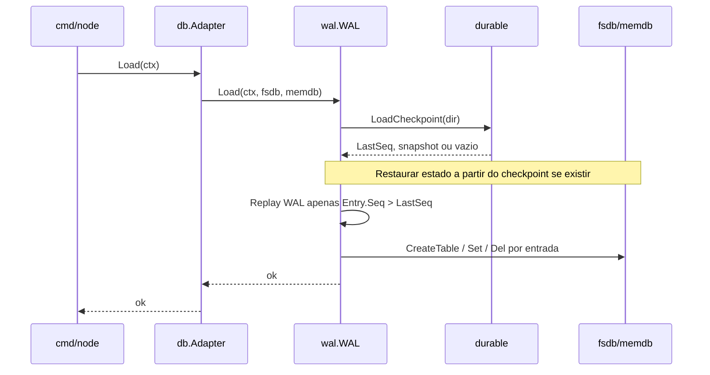

# Checkpoint, WAL e recuperação ao arranque

Este documento descreve a implementação alinhada com [refining/01_checkpoint_WAL.md](../refining/01_checkpoint_WAL.md): uso de **LSN/Seq** no WAL, **checkpoint** durável em filesystem e **replay** apenas do que ainda não está refletido no estado persistido. O objetivo é manter o arranque rápido e o ficheiro de log controlado, sem expor estas regras ao `internal/db/adapter.go`.

## Objetivos

1. **Checkpoint**: marcar até que **sequência monótona** do WAL (`Entry.Seq`) o estado considerado durável (dados em disco + metadados) já incorpora todas as mutações até essa sequência.
2. **Arranque**: ao inicializar, **sempre** executar um fluxo de recuperação (hoje exposto como `LogDb.Load` e chamado a partir de `db.Adapter.Load` no boot).
3. **Sobrevivência a reinício/crash**: o “último save” do checkpoint **não** pode viver só em memória; deve ser escrito de forma **atómica** no filesystem (padrão já descrito em `internal/durable` com ficheiro temporário + `rename`).
4. **Encapsulamento**: `internal/db/adapter.go` continua a orquestrar apenas **WAL → fsdb/memdb** via a interface `LogDb`; **não** conhece caminhos de checkpoint, `LastSeq`, truncagem de WAL nem formato CBOR do checkpoint.

## MVP implementado (estado atual)

- **Metadata-only**: `durable.LoadLastSeq` / `durable.SaveLastSeq` persistem só `LastSeq` (e versão) em `checkpoint.cbor`, sem snapshot de tabelas no arranque do `cmd/node`.
- **Invariante**: com replay parcial, o **`fsdb` em disco** deve refletir todas as mutações com `Seq <= LastSeq` antes de gravar o checkpoint (no adapter atual: WAL → fsdb → memdb, síncrono). O **`memdb`** repõe-se com o *tail* do WAL (`Seq > LastSeq`).
- **Config**: `wal.Options.Checkpoint` (`Dir`, `TruncateAfterCheckpoint`; `EveryNWrites` e `MaxWalBytes` reservados para disparo automático coordenado com o `fsdb`).
- **API**: `WAL.Checkpoint()` faz `Flush`, grava `LastSeq` e, se `TruncateAfterCheckpoint`, trunca o WAL mantendo `w.seq` para o próximo append. Após um **`Load` bem-sucedido**, se `Checkpoint.Dir` estiver definido, o WAL chama **`Checkpoint()`** automaticamente para alinhar o ficheiro de metadados com o estado já recuperado.

## Conceitos (resumo)

| Conceito | Significado neste projeto |
|----------|---------------------------|
| **Seq / LSN** | `uint64` monótono por registo no WAL (`internal/wal.Entry.Seq`), ordem total para replay. |
| **Batch** | Como se escrevem mutações em massa (ex.: fsync periódico, escrita em `fsdb`). |
| **Checkpoint** | Ponto em que se declara: “estado durável reflete tudo até **Seq = N**”; a partir daí o WAL pode ser **truncado/rotacionado** até N (ou equivalente por segmentos). |
| **Último save** | Metadados + eventual snapshot no filesystem, geridos por `internal/durable`, contendo no mínimo o **último Seq aplicado** ao estado que o checkpoint representa. |

## Responsabilidades por pacote

### `internal/wal`

- Define o **formato do log**, `Options` (durabilidade, hooks) e, no desenho alvo, **toda a configuração visível ao resto da app** relacionada com WAL + checkpoint: por exemplo diretório de dados, política de `fsync`, limiares para disparar checkpoint, tamanho máximo do WAL antes de forçar checkpoint (valores concretos ficam em `wal.Options` ou sub-struct dedicada, não no adapter).
- Implementa **`Load` de recuperação**: orquestra (1) leitura do último checkpoint via abstração mínima, (2) hidratação do estado em memória/disco conforme contrato com `fsdb`/`memdb`, (3) **replay do WAL apenas para registos com `Seq > LastSeq`** do checkpoint.
- Opcionalmente: após checkpoint bem sucedido, **truncar** o ficheiro WAL ou rodar segmentos, mantendo invariantes de escrita e replay.

O adapter continua a chamar apenas:

```go
logdb.Load(ctx, f.fsdb, f.memdb)
```

sem parâmetros extra de checkpoint.

### `internal/durable`

- **Única camada** que conhece o layout em disco do checkpoint (nome de ficheiro, versão, atomicidade `tmp` + `rename`).
- Expõe operações do tipo: carregar metadados/snapshot e devolver `LastSeq`; gravar checkpoint com `LastSeq` atualizado **depois** de o estado durável refletir as mutações até esse Seq.
- Persistência **obrigatória** em filesystem; reinício da aplicação ou da máquina não pode depender de estado só em RAM para saber “por onde continuar” no WAL.

Nota: existe código de referência em `internal/durable/checkpoint.go` (CBOR, `LastSeq`, tabelas). A implementação final deve alinhar o tipo de base de dados (ex.: `memdb` atual vs legado) com o que o nó usa em produção, mantendo o contrato **Seq alinhado com o WAL**.

### `internal/db/adapter.go`

- Mantém o papel de **fachada**: `Set`/`Delete` escrevem no WAL e depois em `fsdb`/`memdb` (hoje síncrono; async é trabalho futuro).
- **`Load(ctx)`**: delega **inteiramente** no `LogDb` a política de “ler checkpoint + replay parcial do WAL”. O adapter **não** importa `durable`, **não** lê `LastSeq`, **não** abre ficheiros de checkpoint.
- Comentários de TODO sobre replay parcial deixam de ser responsabilidade do adapter quando o `WAL.Load` incorporar checkpoint + filtro por `Seq`.

### `cmd/node` (composição)

- Constrói `wal` com `wal.Options` (incl. caminhos e políticas acordadas na spec).
- Injeta o WAL como `LogDb` no `db.New(...)`.
- Chama `db.Load(ctx)` uma vez no arranque, como já ocorre conceptualmente.

## Fluxo de arranque (recuperação)



**Invariante**: após `Load`, o conjunto visível em `fsdb`/`memdb` deve ser o mesmo que se obtinha se se tivesse feito replay completo do WAL desde o início, assumindo que o checkpoint foi gravado **somente** quando o estado durável já incluía todas as mutações até `LastSeq`.

## Fluxo de checkpoint (escrita do “último save”)

1. Critério de disparo (configurável em `wal`): tempo decorrido, bytes escritos no WAL, número de operações, ou comando administrativo.
2. Garantir que **dados em `fsdb`** (e o que o checkpoint serializar) refletem todas as mutações até o **Seq** escolhido (coordenação com batch/fsync).
3. `durable.SaveCheckpoint(..., lastSeq)` com escrita **atómica** no filesystem.
4. Atualizar o WAL (truncagem ou novo segmento ativo) de forma consistente com o `LastSeq` gravado, para que um crash entre passos seja recuperável (ordem recomendada e fsyncs devem constar na implementação; regra usual: **primeiro** estado durável + checkpoint, **depois** podar WAL, ou usar segmentos para permitir rollback lógico).

Detalhes de ordenação exata (WAL vs fsdb vs checkpoint) devem ser documentados no código do `wal` na altura da implementação, para evitar janelas em que o checkpoint indique um `Seq` que o `fsdb` ainda não reflete.

## Configuração “fica no WAL”

- Campos em `wal.Options` (ou tipo embutido `wal.CheckpointConfig`) concentram: diretório do checkpoint, intervalos, limites, flags de truncagem.
- `db.Adapter` e `LogDb` **não** ganham parâmetros novos para paths de checkpoint: o `WAL` já nasce configurado com o que precisa para falar com `durable` (por injeção de `dir` ou interface pequena tipo `CheckpointStore` implementada por `durable`, instanciada no `main` ou fábrica do WAL).

Isto respeita a orientação do projeto: interfaces no consumidor quando fizer sentido; aqui o consumidor do checkpoint na recuperação é o próprio `wal`, não o adapter.

## Formato e ficheiros no disco (convencional)

| Artefacto | Responsável | Notas |
|-----------|-------------|--------|
| Ficheiro WAL (ex.: `data.wal`) | `internal/wal` | Append-only, `Seq` por registo. |
| `checkpoint.cbor` (ou evolução versionada) | `internal/durable` | Contém `LastSeq` e materialização necessária para hidratar tabelas. |

Caminhos concretos são decisão de deployment; apenas entram em `wal.Options` / flags do `cmd/node`, não no adapter.

## Testes recomendados

- Arranque **sem** checkpoint e com WAL populado: replay completo, `Seq` final consistente.
- Arranque **com** checkpoint + sufixo do WAL: apenas entradas com `Seq > LastSeq` são aplicadas.
- Crash simulado: interrupção após metade das escritas; ao voltar a arrancar, estado igual ao esperado após deduplicação/repair já suportada pelo `wal.Replay` / `RepairTruncatesTail`.
- Checkpoint atómico: corrupção ou ficheiro `.tmp` residual não quebra o arranque (comportamento definido: ignorar tmp antigo, usar último `rename` válido).

## Referências no repositório

- Refinamento de produto: [refining/01_checkpoint_WAL.md](../refining/01_checkpoint_WAL.md).
- WAL e replay: `internal/wal/wal.go`, `internal/wal/entry.go`.
- Checkpoint filesystem: `internal/durable/checkpoint.go`.
- Fachada DB: `internal/db/adapter.go`.
- Boot: `cmd/node/main.go` (`db.Load` após construir o WAL).

## Fases de implementação sugeridas

1. **Contrato Seq**: garantir que todo append no WAL obtém `Seq` estritamente crescente e que o checkpoint guarda o mesmo espaço de valores.
2. **Replay parcial no `WAL.Load`**: ler `LastSeq` via `durable`, filtrar `apply` por `e.Seq > LastSeq` (ou seek físico no ficheiro se no futuro existir índice/offset por Seq).
3. **Checkpoint write path**: integrar `SaveCheckpoint` com o critério configurado em `wal.Options` e com a consistência frente ao `fsdb`.
4. **Truncagem/segmentos**: reduzir tamanho do WAL após checkpoint estável.
5. **Limpeza do adapter**: remover comentários/TODO que duplicam política já encapsulada no `wal`.

---

Com isto, a regra de negócio “ao reiniciar, ler o WAL **a partir do último save**” fica centralizada no **`wal` + `durable`**, com persistência em disco e **`adapter` agnóstico** a esses detalhes.
