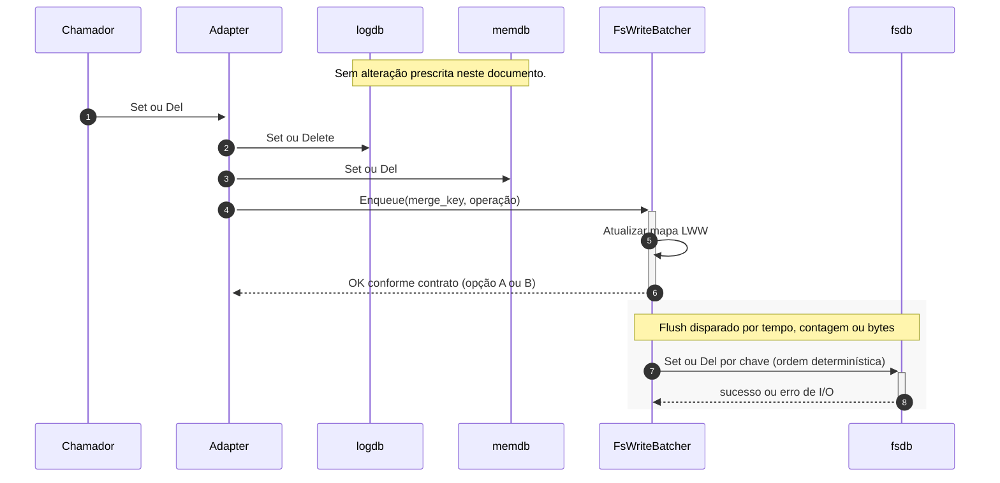

# Redução de pressão no filesystem: batch e merge no `fsdb` (última escrita por chave)

## Escopo desta especificação

**Em âmbito:** apenas a implementação do caminho de escrita que persiste estado em **filesystem via `fsdb`** (batch, merge LWW, flush, limites de memória, concorrência do batcher e testes desse componente).

**Fora de âmbito:** **`logdb` (WAL)**. Este documento **não** define batch, buffer, coalesce, alteração de `Durability`, truncamento de WAL, nem política de append no log. O `logdb` permanece como estiver no produto; qualquer chamada a ele no `Adapter` é **transparente** a esta especificação — aqui só se descreve o que muda **entre** a decisão de negócio e as chamadas efetivas a `fsdb.Set` / `fsdb.Del` (e equivalentes).

Origem da ideia: `refining/02_pression_of_disc.md` (batch no armazenamento em disco secundário). A secção seguinte aplica-se **só** a esse armazenamento (`fsdb`), não ao log.

---

Este documento formaliza a abordagem implementável no repositório **kvs** (`github.com/IsaacDSC/kvs`). Hoje, `internal/db.Adapter` chama `fsdb` **por operação**; o objetivo aqui é reduzir I/O **somente nesse backend**.

## Objetivo (somente `fsdb`)

- Diminuir **volume de I/O** e **número de syscalls** no caminho de dados em arquivo do **`fsdb`**.
- Para atualizações **repetidas sobre a mesma chave** (par tabela + chave primária), **no `fsdb`** persistir apenas o **efeito final** dentro de uma janela de batch (*last-write-wins*, LWW).
- Opcionalmente agrupar escritas de **chaves diferentes** num **único flush** ao `fsdb`, mantendo LWW por chave.

## Contexto no código atual (relevante para `fsdb`)

- `internal/db.Adapter.Set` invoca `fsdb.Set` na mesma sequência que outras camadas; há `TODO` para async — a **materialização em lote no `fsdb`** é o alvo natural desse alívio de pressão no filesystem **de dados**, sem tocar no `logdb` neste desenho.

## Princípios de desenho (exclusivamente `fsdb`)

### 1. Chave de coalescência (*merge key*)

- Usar uma chave estável alinhada ao modelo de entidade no `fsdb`, por exemplo `(table, key)` (PK).
- Referência cruzada com campos de `WAL` **não** é requisito de implementação do batcher; basta consistência com o que o `fsdb` usa para localizar o registo.

Para `Delete`, o merge representa o **último efeito** na janela: `Set, Set, Del` → tombstone final; `Del, Set` → prevalece o `Set`.

### 2. Ordem e determinismo ao aplicar no `fsdb`

- **Mesma chave:** preservar ordem lógica de chegada ao batcher para calcular o LWW.
- **Chaves distintas:** ao despejar para o `fsdb`, usar ordem **determinística** (ex.: ordenar `merge_key`) para reprodutibilidade e depuração.

### 3. Memória e limites

O batch deve ter limites explícitos:

- por contagem (ops ou chaves distintas);
- por bytes estimados dos valores coalescidos;
- por tempo (flush periódico).

Ao atingir um limite, flush do conjunto atual de chaves sujas **para o `fsdb`**.

## Abordagem de implementação (só caminho `fsdb`)

### Diagrama de sequência (referência de camadas)

Camadas da implementação de referência: o **`Adapter`** orquestra o fluxo; **`FsWriteBatcher`** é a **nova** camada interposta **só** entre o adaptador e o **`fsdb`**; **`logdb`** e **`memdb`** são vizinhos do adaptador **fora do escopo** desta spec (mantêm-se como hoje).



O bloco cinzento representa um **ciclo de flush** que pode ocorrer **depois** do retorno ao chamador (opção A) ou **antes** de fechar o pedido (opção B), conforme o contrato escolhido. Vários `Enqueue` podem preceder um único flush que agrupa várias chaves.

Opcionalmente, o `Adapter` compõe dependências de forma que o valor “`fsdb`” injetado seja já um **`FsWriteBatcher`** que delega no `fsdb` real, desde que a interface de escrita ao disco de dados seja a mesma.

### Componente: `FsWriteBatcher` (nome ilustrativo)

Colocado **entre** o orquestrador (ex.: `Adapter`) e a implementação concreta de `fsdb` (ou encapsulado **dentro** do tipo que hoje implementa `DB` para filesystem):

1. **Ingestão:** `Set` / `Delete` já validados ao nível de negócio (payload / tombstone).
2. **Buffer em memória:** `map[MergeKey]OpCoalescida` (valor final ou remoção).
3. **Gatilhos de flush:** tempo, contagem, bytes (configuráveis).
4. **Flush:** aplicar ao `fsdb` subjacente apenas as entradas do mapa (sub-lotes ordenados se necessário); **cada chave** na janela vira no máximo **uma** `Set` ou **uma** `Del` no `fsdb`.
5. **Concorrência:** `mutex` ou fila single-writer no batcher; `context.Context` para cancelar esperas, não para “pular” persistência já prometida sem política explícita de erro.

### Integração no `Adapter` (apenas o braço `fsdb`)

Alteração prescrita neste documento:

- **Substituir** chamadas diretas `fsdb.Set` / `fsdb.Del` por entradas no **`FsWriteBatcher`** que, no flush, delega no `fsdb` real.

**Não prescrito aqui:** ordem ou política em relação ao `logdb` ou ao `memdb`. O adaptador pode manter a ordem atual de chamadas às outras camadas; o essencial é que **todas** as escritas que hoje vão ao `fsdb` passem pelo batcher descrito acima.

Contrato de retorno do `Set`/`Del` **em relação ao `fsdb`** (escolha de produto, ainda só no lado disco):

- **Opção A:** retorno após enfileirar no batcher (menor latência; o `fsdb` pode atrasar-se até ao próximo flush).
- **Opção B:** retorno após `flush` que inclui essa chave (mais pressão no caminho crítico, mas disco de dados alinhado ao retorno).

Documentar qual opção vale para a API. **Durabilidade global** (incluindo o que o `logdb` garante) não é definida neste ficheiro.

### Metadados que dependem do `fsdb` já materializado

Se existir ou surgir metadata do tipo “até que sequência lógica o **conteúdo em ficheiro** reflete”, essa metadata **só pode avançar** depois de um flush de batch ao `fsdb` que tenha aplicado com sucesso as operações correspondentes. O rastreio de sequência (se usado) é **por opção coalescida** (ex.: maior sequência coberta na janela por chave, depois máximo global ao fechar o batch). Isto restringe-se à **consistência disco de dados / checkpoint de dados**, sem especificar comportamento do `logdb`.

## Detalhes de merge (última escrita) no `fsdb`

```
estado := map[MergeKey]OpCoalescida

para cada op em ordem de chegada ao batcher:
  estado[key] = combinar(estado[key], op)  // LWW
```

No flush para o `fsdb`:

- valor vivo → uma `fsdb.Set`;
- tombstone final → uma `fsdb.Del` (conforme a API do `fsdb`).

**Efeito:** N atualizações à mesma chave na janela → **1** escrita relevante no `fsdb` (mais o custo de fsync do backend, se existir, por unidade de flush).

## Testes recomendados (âmbito `fsdb`)

- Determinismo do mapa final de merge.
- Intercalação `Set`/`Delete`.
- Limites (tempo, contagem, bytes) a disparar flush.
- Concorrência na mesma chave → uma escrita no mock do `fsdb` por janela fechada.
- Falha no meio do flush: política de erro/retry e estado do batcher; o `logdb` **não** precisa de aparecer nestes testes se o SUT for só o batcher + `fsdb` fake.

## Riscos e mitigação (só perspetiva `fsdb`)

| Risco | Mitigação |
|-------|-----------|
| Janela entre aceitar op e aparecer no `fsdb` | Documentar contrato (opção A vs B); testes de flush. |
| RAM com muitas chaves distintas | Limites + flush forçado. |
| Deadlock com locks do `Adapter` | Ordem de locks definida ou batcher com fila fora do lock largo do adaptador. |

## Resumo

Esta especificação cobre **unicamente** batch, merge LWW e flush **no `fsdb`**, para reduzir pressão no filesystem de dados. **`logdb` não é alvo de implementação aqui** — nenhuma alteração ao WAL é parte do escopo. O passo seguinte de código é introduzir o batcher com limites e testes focados no `fsdb`, e integrar no `Adapter` apenas a substituição das escritas diretas para o `fsdb`.
